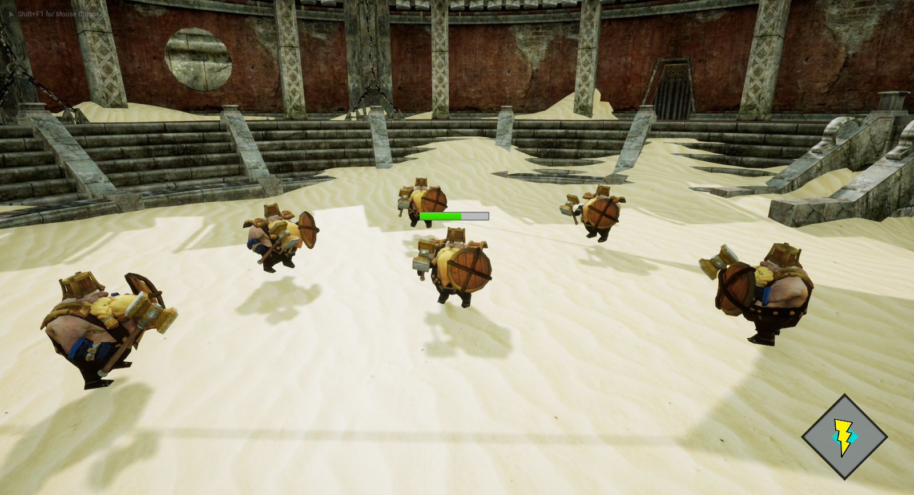

# Gladiator Unreal Engine

## Presentation
-----------

### Introduction
-----------
 `Gladiator` is our second game project made on Unreal Engine 4.  
 The objective of this project is to realize a brawler game by using C++ scripts in Unreal Engine  
 This project has been made by **RABINNE Lenny** and **ERBISTI Matéo**.  
 It started on `October 24th, 2022` and finished on `November 21st, 2022`.  

### Description
-----------
In this brawler, your objective is to kill 5 enemies in the arena by using your hammer and your shield to protect yourself.  
You can also use an ultimate ability that will deal damage to every enemy.  

#### Controls :
-----------
You can play with a keyboard and mouse or with a controller.

Controls Keyboard and Mouse: 
`Move` : WASD  
`Turn the camera` : Mouse  
`Attack` : Left Mouse Button  
`Shield` : Right Mouse Button  
`Ultimate` : R  
`Lock/Unlock an Enemy` : Shift  
`Change Lock` : Mouse Wheel  
`Restart` : Enter  

Controls Controller: 
`Move` : Left Stick  
`Turn the camera` : Right Stick  
`Attack` : Right Trigger  
`Shield` : Left Trigger   
`Ultimate` : Face Button Bottom  
`Lock/Unlock an Enemy` : Right Stick Button  
`Change Lock` : Right Shoulder  
`Restart` : Start  

#### Player: 
-----------

You will start the game with 5 lives.  
You can lock an enemy which makes it easier to go after him and attack him.  
Each time an enemy hit you or you deal damage to them, you'll earn an ultimate charge. With 6 ultimate charges, you can press the Ultimate button to make a special attack.  
The Ultimate Charge is represented with a Widget at the bottom right corner of the screen.  

#### Enemies : 
-----------
The enemies will stay within a good range of the player so that they can stay safe.  
They will also move to another location if another enemy is located between them and the player.  
Each second, the nearest Enemy to the player will rush you and attack.  
You can protect yourself by facing the enemy and holding your shield.  
Each Enemy has 3 lives, you can see their life bar by locking them.  

We used a Behavior Tree, blackboard and created some C++ Tasks to make our artificial intelligence.  
We found the Behavior Tree really useful and quite easy to use to create AI. <br.>

#### Difficulties: 
-----------

At the beginning of the project, it was kind of hard to approach C++ with Unreal Engine.  
There are a lot of things to know that are specific to Unreal such as UFUNCTION, UPROPERTY, all the specifiers, but also the architecture of Unreal  

We also struggled a bit to begin our artificial intelligence but we found good documentation that helped us understand how tasks, behavior trees, and blackboards work together.  

